# 文章管理系统

## 1. 基本信息

- 作者: GMCY
- 系列: 大学课程作业

- 仓库: [GitHub](https://github.com/GMCY2020/University-ArticleSystem) | [Gitee](https://gitee.com/GMCY2020/University-ArticleSystem)

- 话题(GitHub): [university-coursework](https://github.com/topics/university-coursework) \ [jsp](https://github.com/topics/jsp)

- 创建时间: 2023/12/26

## 2. 介绍

背景

- 课程大作业: 个人使用 `jsp` 写一个项目

说明

- `jsp` ...... , 只能用 `jsp` ...... ←_←
- 前后端不分离, 同时开发

## 3. 环境

编辑器: `Idea 2022`

JDK版本: `jdk 11.0.18`

tomcat版本: `tomcat 9.0.82`

mysql版本: `mysql80`

## 4. 使用

- `Idea` 或者 其它数据库管理工具 连接数据库, 加载 `docs\artSystem.sql` 文件
- `jdbc` 用户和密码 在 `src\Dao` 里面的两个文件更改
- `jdbc` 的 `sql语句` 执行后遇到错误会抛出, 但不处理...

## 5. 效果展示

- 首页 界面
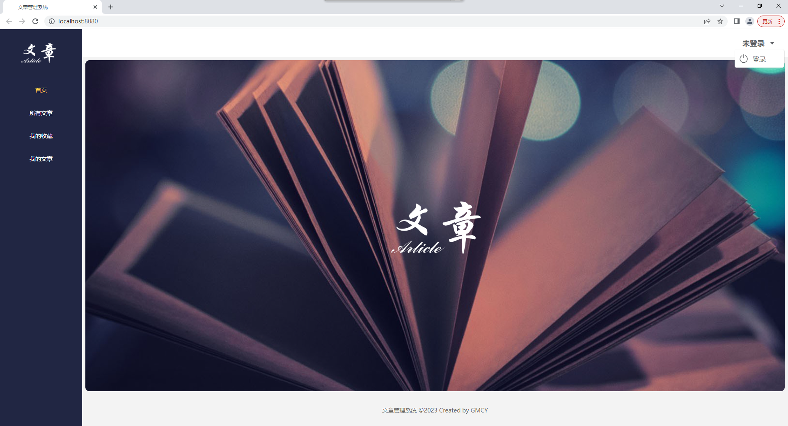

- 登录 界面

- 注册 界面
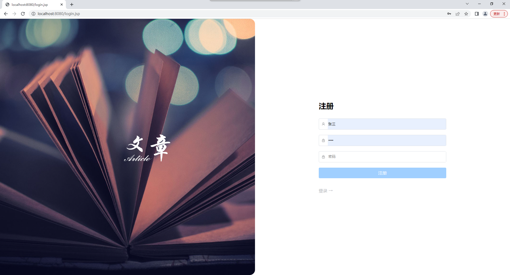

- 所有文章 界面  
收藏
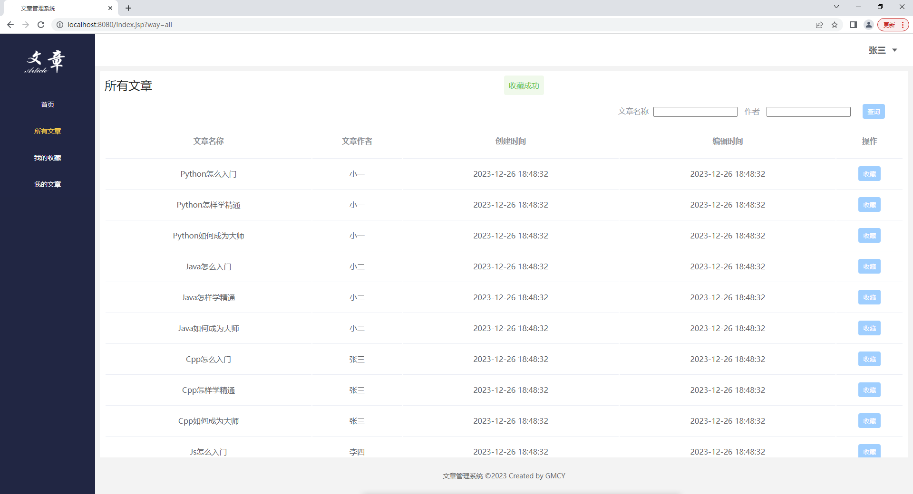
搜索
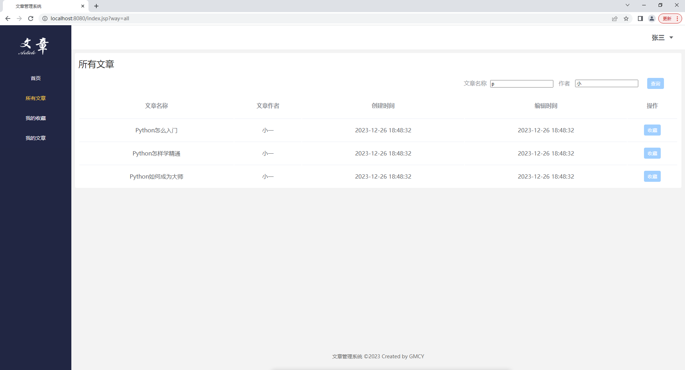

- 我的收藏 界面
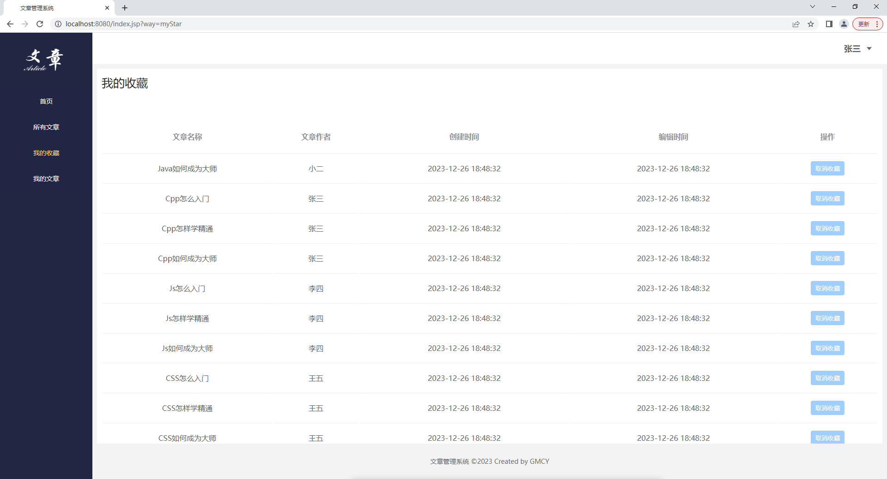
取消收藏
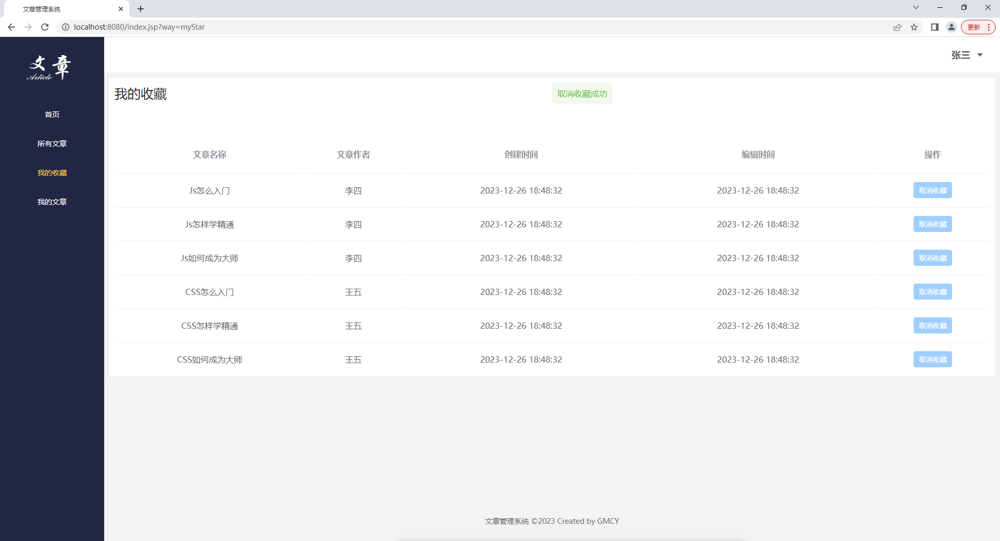

- 我的文章 界面
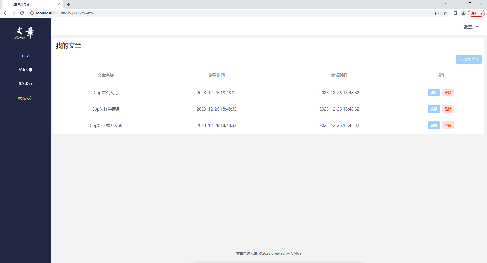
添加文章
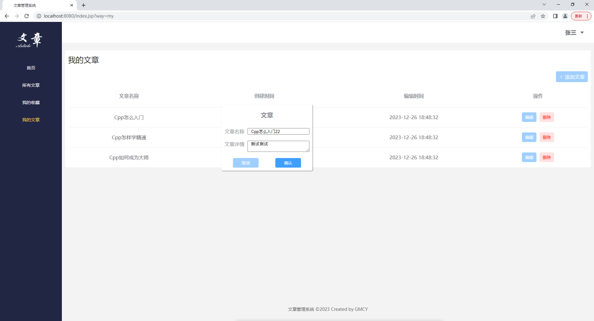
编辑文章
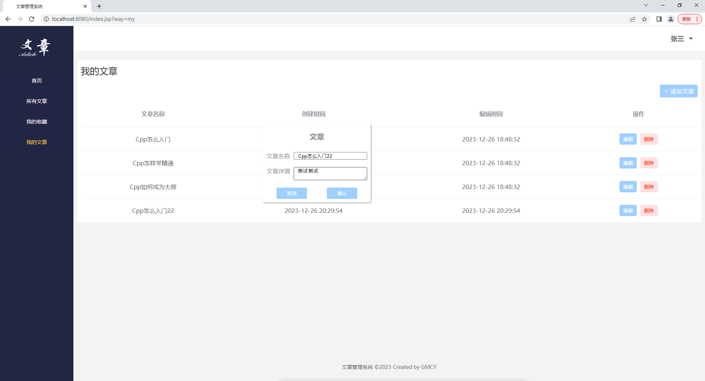
删除文章
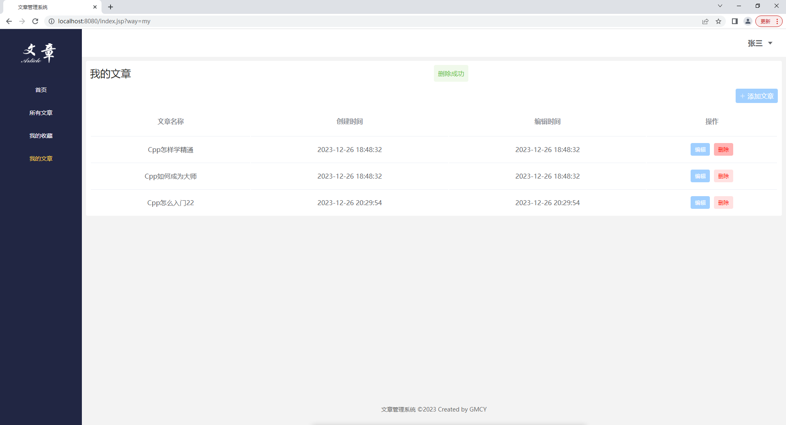

- 文章详情 界面
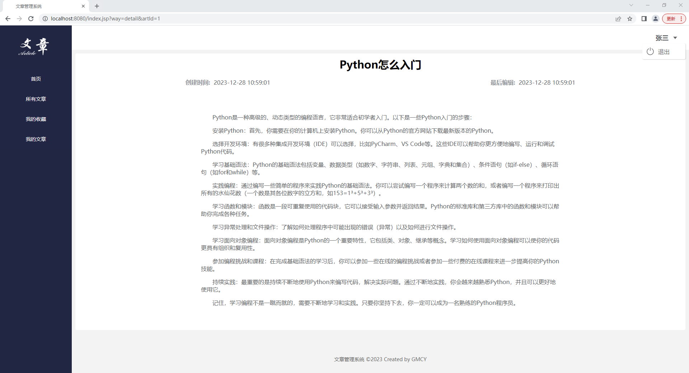